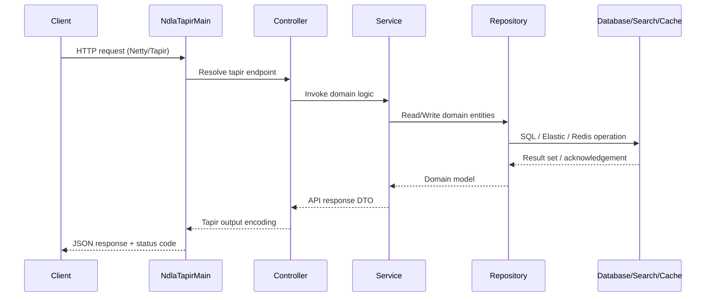
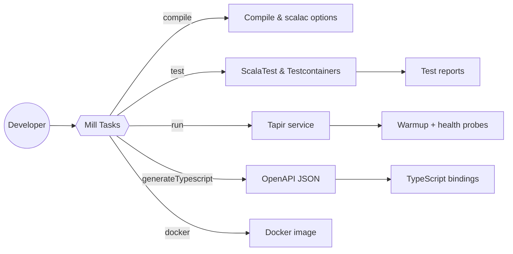

# NDLA Backend Documentation

## Overview
The NDLA backend monorepo hosts the Scala services that power the Norwegian Digital Learning Arena (NDLA). Each top-level API in this repository corresponds to a deployable service responsible for a specific facet of the platform (articles, media, personalization, search, etc.). The repository is built with [Mill](https://mill-build.org/) and embraces a shared set of foundational libraries (`common`, `network`, `database`, `search`, and others) for HTTP wiring, configuration, observability, persistence, and integrations.

### Technology Stack
| Area | Primary Technologies |
| --- | --- |
| Language & Build | Scala 3.7.2, Mill 1.0.4, custom Mill modules in `modules/` |
| HTTP & Routing | [sttp tapir](https://tapir.softwaremill.com/) Netty server, custom `TapirApplication` & `NdlaTapirMain` harness |
| Persistence | PostgreSQL (via ScalikeJDBC), Flyway migrations, Redis (Jedis) |
| Search | Elasticsearch 8.x through `elastic4s` wrapper (`search` module) |
| Messaging & Integrations | AWS SDK v2 (S3, Transcribe), Brightcove SDK, Feide, NDLA internal APIs |
| Serialization & Validation | Circe JSON, Enumeratum, custom validators (`validation` module) |
| Testing | ScalaTest, Testcontainers (Postgres & Elasticsearch), shared fixtures in `scalatestsuite` & `testbase` |
| Frontend Contract | OpenAPI generation + TypeScript emitters in `typescript/types-backend` |

### High-Level Component Map
The diagram below groups the major deployable services, shared libraries, and external systems. Connections represent the primary runtime dependencies.

```mermaid
graph TD
    Consumers((Clients & Internal Tools))

    subgraph SharedLibraries[Shared Foundations]
        Common[common]
        Network[network]
        DatabaseLib[database]
        SearchLib[search]
        Mapping[mapping]
        Validation[validation]
    end

    subgraph ContentAPIs[Content & Media APIs]
        ArticleAPI[article-api]
        DraftAPI[draft-api]
        ConceptAPI[concept-api]
        ImageAPI[image-api]
        AudioAPI[audio-api]
        LearningpathAPI[learningpath-api]
        FrontpageAPI[frontpage-api]
    end

    subgraph PlatformServices[Platform & Aggregation]
        SearchAPI[search-api]
        MyNDLAAPI[myndla-api]
        OEmbedProxy[oembed-proxy]
    end

    Consumers --> ArticleAPI
    Consumers --> DraftAPI
    Consumers --> ConceptAPI
    Consumers --> ImageAPI
    Consumers --> AudioAPI
    Consumers --> LearningpathAPI
    Consumers --> FrontpageAPI
    Consumers --> SearchAPI
    Consumers --> MyNDLAAPI
    Consumers --> OEmbedProxy

    ArticleAPI --> Postgres[(PostgreSQL)]
    DraftAPI --> Postgres
    ConceptAPI --> Postgres
    ImageAPI --> Postgres
    AudioAPI --> Postgres
    LearningpathAPI --> Postgres

    ArticleAPI --> Redis[(Redis)]
    DraftAPI --> Redis

    SearchAPI --> Elastic[(Elasticsearch)]
    ArticleAPI --> Elastic
    DraftAPI --> Elastic
    ConceptAPI --> Elastic
    ImageAPI --> Elastic
    AudioAPI --> Elastic
    LearningpathAPI --> Elastic

    AudioAPI --> S3[(AWS S3)]
    ImageAPI --> S3
    AudioAPI --> Transcribe[(AWS Transcribe)]
    AudioAPI --> Brightcove[(Brightcove Video)]
    MyNDLAAPI --> Feide[(Feide Auth)]
    OEmbedProxy --> External[(External oEmbed Providers)]

    Common --> ArticleAPI
    Common --> DraftAPI
    Common --> ConceptAPI
    Common --> ImageAPI
    Common --> AudioAPI
    Common --> LearningpathAPI
    Common --> FrontpageAPI
    Common --> SearchAPI
    Common --> MyNDLAAPI
    Common --> OEmbedProxy

    Network --> ArticleAPI
    Network --> DraftAPI
    Network --> ConceptAPI
    Network --> ImageAPI
    Network --> AudioAPI
    Network --> LearningpathAPI
    Network --> FrontpageAPI
    Network --> SearchAPI
    Network --> MyNDLAAPI
    Network --> OEmbedProxy

    SearchLib --> SearchAPI
    SearchLib --> ArticleAPI
    SearchLib --> DraftAPI
    SearchLib --> ConceptAPI
    SearchLib --> ImageAPI
    SearchLib --> AudioAPI
    SearchLib --> LearningpathAPI
```



## Repository Layout
| Path | Description |
| --- | --- |
| [`article-api/`](article-api/) | Deployable Article service (Tapir controllers, repositories, migrations, search/index wiring). |
| [`audio-api/`](audio-api/) | Audio and series service with S3 storage and AWS Transcribe orchestration. |
| [`concept-api/`](concept-api/) | Concept glossary service with draft/published flows and Elastic indexing. |
| [`draft-api/`](draft-api/) | Editorial draft workspace with attachment handling and multi-service integrations. |
| [`frontpage-api/`](frontpage-api/) | Curated frontpage/subject/film page management APIs. |
| [`image-api/`](image-api/) | Image metadata, storage, and search service. |
| [`learningpath-api/`](learningpath-api/) | Learning path CRUD, validation, and search orchestration. |
| [`myndla-api/`](myndla-api/) | Personalized MyNDLA service (folders, robots, configs). |
| [`oembed-proxy/`](oembed-proxy/) | External oEmbed proxy and cache layer. |
| [`search-api/`](search-api/) | Aggregated search surface across NDLA resources. |
| [`common/`](common/) | Shared utilities (configuration, logging, converters, AWS helpers). |
| [`network/`](network/) | Tapir bootstrapping, HTTP clients, auth/Redis helpers. |
| [`database/`](database/) | Pooled data source, Flyway migration runner, DB utilities. |
| [`search/`](search/) | Elasticsearch abstractions and index helpers. |
| [`mapping/`](mapping/), [`validation/`](validation/), [`language/`](language/) | Domain helper libraries for code mappings, validation rules, and ISO languages. |
| [`integration-tests/`](integration-tests/) | Cross-service integration test harness. |
| [`dependency-graph/`](dependency-graph/) | CLI for detecting Scala dependency cycles. |
| [`modules/`](modules/) | Custom Mill traits (`BaseModule`, `OpenAPITSPlugin`, `DockerComponent`, etc.). |
| [`tapirtesting/`](tapirtesting/), [`testbase/`](testbase/), `scalatestsuite/` | Shared testing infrastructure and Tapir fixtures. |
| [`typescript/types-backend/`](typescript/types-backend/) | Generated OpenAPI specs and TypeScript bindings for frontend consumers. |
| [`build.mill`](build.mill), [`build.sh`](build.sh), [`fmt.sh`](fmt.sh), [`checkfmt.sh`](checkfmt.sh) | Repository-level build entry points and helper scripts. |
| [`log4j/`](log4j/) | Logging configuration baked into each service’s resource set. |

## Runtime Architecture
Every deployable service follows the same composition pattern:
- `Main.scala` sets environment variables, instantiates service-specific properties, and delegates to `MainClass`.
- `MainClass` extends `NdlaTapirMain`, wiring warmup calls, database migrations, and graceful shutdown hooks.
- `ComponentRegistry.scala` constructs all run-time dependencies using Scala given instances: repositories, services, external clients, health controllers, Swagger, and route aggregation.
- Routes are defined through tapir endpoints declared in controller classes; responses flow through shared error handling (`network/tapir/ErrorHandling.scala`).
- Persistence access is managed by ScalikeJDBC repositories; search functionality is provided by `search` module services; migrations run via Flyway on start.



Warmup and health: `MainClass.warmup` triggers synthetic requests via `Warmup.warmupRequest`, and every service exposes `/health` (readiness & liveness) powered by `TapirHealthController`. Shutdown hooks wait for readiness probes to detect termination before stopping Netty.

## Service Modules
The core services can be grouped by responsibility. Each entry highlights primary data stores and key integrations exposed in `ComponentRegistry.scala` implementations.

### Content Lifecycle
- **Article API** — Manages published article revisions backed by PostgreSQL (`article_id`, `revision`, JSONB payloads), caches read models in Redis, indexes documents to Elasticsearch for relevance search, and coordinates with taxonomy, image, audio, and frontpage APIs. Content validation enforces HTML and embed rules via the `validation` module.
- **Draft API** — Handles authoring drafts, attachments (stored in S3), and editorial workflow state. Maintains its own PostgreSQL tables and Elasticsearch indices, reuses Article API clients for publication, and exposes user data endpoints. Includes H5P, taxonomy, and learning path integrations.
- **Concept API** — Stores and indexes reusable concepts with Elasticsearch-backed search endpoints and PostgreSQL persistence. Provides embed metadata to other services.
- **Learningpath API** — CRUD for learning paths and license metadata along with search capabilities; consumes taxonomy data for categorization.
- **Frontpage API** — Aggregates curated content for NDLA landing pages, combining article, image, and taxonomy data.

### Media & Assets
- **Image API** — Stores metadata in PostgreSQL, raw assets in S3, serves dynamic crops/resizes, and controls copyright agreements. Indexes searchable metadata into Elasticsearch.
- **Audio API** — Manages audio files and podcast series. Uses S3 for binaries, PostgreSQL for metadata, Elasticsearch for search, AWS Transcribe for transcript jobs, and Brightcove for streaming metadata.

### Aggregation & Platform
- **Search API** — Provides a unified search facade across the content APIs. Relies on shared `search` module for query composition, leverages Elasticsearch indices from downstream services, and orchestrates fallback logic.
- **MyNDLA API** — Personalization service exposing folders, arena data, and user-specific entities. Works with Feide authentication, integrates with other APIs via shared clients.
- **oEmbed Proxy** — Acts as a CORS-safe proxy for external oEmbed providers listed on oembed.com, authenticating requests through NDLA’s access tokens.

Every service exposes OpenAPI documentation (accessible via `/_/swagger` endpoints) and includes a warmup + health controller to support rolling deploys.

## Shared Libraries & Modules
- **`common/`** — Environment configuration (`Environment.setPropsFromEnv`), property trait hierarchy, logging wrappers, AWS helpers, caching utilities, converters, validators, correlation ID propagation, and warmup helpers.
- **`network/`** — Tapir bootstrapping (`NdlaTapirMain`, `TapirApplication`, `Routes`), Swagger generator, HTTP clients for internal APIs (search, frontpage, taxonomy, MyNDLA, Feide), Redis wrappers, and auth utilities.
- **`database/`** — Provides pooled `DataSource` (HikariCP), Flyway-backed migration runner (`DBMigrator`), and convenience helpers for transactional work.
- **`search/`** — Abstracts Elasticsearch via `elastic4s`, defines search language helpers, base query builders, and test utilities for search heavy services.
- **`mapping/`**, **`validation/`**, **`language/`** — Domain helpers for taxonomy mappings, validation rules (HTML, MathML, `<ndlaembed>`), and ISO language tag parsing.
- **`scalatestsuite/`**, **`testbase/`**, **`tapirtesting/`** — Common ScalaTest traits, embedded server fixtures, tapir endpoint assertions, and integration helpers reused across modules.
- **`dependency-graph/`** — Parses SemanticDB output to detect cyclic dependencies between components wired in `ComponentRegistry` files, preventing runtime DI deadlocks.
- **`modules/`** — Mill mixins used by every build definition (`BaseModule`, `DockerComponent`, `OpenAPITSPlugin`, `GithubWorkflowPlugin`, etc.), enabling consistent scalac options, Docker packaging, GitHub Actions YAML generation, and TypeScript codegen.

## Data Stores & External Integrations
- **PostgreSQL** — Primary relational store; each service declares migrations in `db/migrationwithdependencies` and runs them via `DBMigrator` on boot.
- **Elasticsearch** — Search indices handled by `search` module helpers. Services typically have `IndexService` and `SearchService` pairs responsible for synchronization.
- **Redis** — Used for memoization and caching (e.g., article lookups) through `RedisClient` in `network`.
- **AWS S3** — Binary asset storage for images, audio, and draft attachments via `NdlaS3Client` wrappers; buckets configured per service through `*Properties` classes.
- **AWS Transcribe** — Audio transcription pipeline triggered by Audio API.
- **Brightcove** — External video metadata integration from Audio API.
- **Feide & Authentication** — MyNDLA and other services rely on Feide and NDLA auth tokens through shared network clients.
- **Taxonomy, Search, Frontpage, Image APIs** — Many services consume peer APIs using `network.clients` wrappers, enabling reuse without circular HTTP logic.

## Build & Tooling
All build logic is centralized in Mill with custom modules under `modules/`.
- `BaseModule` standardizes Scala compilation sources, scalac options, scalafmt integration (`./fmt.sh` delegates to this), logging resources, and shared dependencies.
- `DockerComponent` (in `modules/DockerComponent.mill`) provides `docker` tasks that drive `build.sh <module>` packaging.
- `OpenAPITSPlugin` runs the service with `--generate-openapi`, copies JSON into `typescript/types-backend/openapi/<service>.json`, and generates TypeScript schema exports. Run via `./mill <module>.generateTypescript`.
- `GithubWorkflowPlugin` emits GitHub Actions workflows per service (see `.github` in upstream usage).
- `modules/Yarn` caches `yarn install` invocations keyed by lockfile hash to accelerate repeated type generation.

Common developer actions:
- `./mill <module>.compile` — Compile a service.
- `./mill <module>.run` — Start a service (reads environment variables from `.env` or shell).
- `./mill <module>.test` — Execute unit tests with ScalaTest.
- `./mill integration-tests.test` — Run cross-service suites (requires Docker for Testcontainers).
- `./fmt.sh` / `./checkfmt.sh` — Format or verify Scala sources across the repo.
- `./build.sh <module>` — Build Docker images using Mill’s Docker support.



## Development Workflow
1. **Environment** — Ensure Java 17+, Mill, Docker, and Yarn are installed. Copy `.env.example` (if available) or export required `*_PORT`, `*_DB_URL`, and AWS credentials for the target service’s `*Properties` class.
2. **Database & Search** — Start local PostgreSQL/Elasticsearch instances (Docker Compose or Testcontainers). Services auto-run Flyway migrations on boot.
3. **Run a Service** — `./mill article-api.run` starts Netty on `props.ApplicationPort` (defaults defined in each `*Properties`). Warmup requests seed caches and mark health readiness.
4. **Iterate** — Use `./fmt.sh` before committing; rely on shared logging configuration in `log4j/` for consistent output.
5. **Generate Contracts** — After changing endpoints or models, run `./mill <module>.generateTypescript` to refresh OpenAPI + TypeScript artifacts.
6. **Dockerize** — `./build.sh <module>` leverages Mill’s Docker module to produce OCI images ready for deployment.

## Testing Strategy
- **Unit & Component Tests** — Each service’s `src/test` directory uses ScalaTest with shared traits from `scalatestsuite` and `testbase`. Testcontainers spin up ephemeral Postgres/Elasticsearch instances where required (see `modules/versions.mill` -> `TestContainersV`).
- **Integration Tests** — `integration-tests/` composes multiple services to validate end-to-end behaviours, relying on shared clients and real HTTP interactions.
- **Tapir Contract Tests** — The `tapirtesting` module adds DSLs for asserting tapir responses and OpenAPI generation consistency.
- **Static Analysis** — `dependency-graph` prevents circular dependency introduction in `ComponentRegistry` wiring. Run with:
  ```bash
  ./mill _.semanticDbData
  ./mill dependency-graph.run
  ```
- **Formatting & Linting** — `./checkfmt.sh` enforces scalafmt rules; CI workflows (see badges in service READMEs) run compile/test/lint pipelines per module.

## Observability & Operations
- **Logging** — Services share Log4j2 YAML configs located in `log4j/main` and `log4j/test`, pulled into resources via `BaseModule.resources`.
- **Health & Warmup** — `/health` exposes readiness/liveness states; warmup requests pre-load caches and mark health controllers as ready. Shutdown hooks wait for readiness probes to fail before stopping Netty.
- **Swagger & OpenAPI** — Each service’s `SwaggerController` aggregates tapir endpoints into an OpenAPI spec served at `/_/swagger`, ensuring a single source for API docs and TypeScript codegen.
- **Correlation IDs** — `common/CorrelationID` middleware injects request IDs for tracing across services.

## TypeScript Contract Generation
Frontend teams consume API schemas generated from tapir definitions:
1. `./mill <module>.generateTypescript` runs the service with `--generate-openapi` to produce `<module>.json`.
2. `modules/OpenAPITSPlugin` triggers Yarn scripts in `typescript/types-backend` to emit `<module>.ts` export files that mirror backend schemas (both `Type` and `IType` aliases maintained for backwards compatibility).
3. Generated files live in `typescript/types-backend/{openapi/,*.ts}` and should be committed alongside backend changes.

## Additional Resources
- Per-service READMEs (e.g., `article-api/README.md`) provide endpoint-specific documentation and migration notes.
- `README.md` at repo root hosts quick-start commands for compiling, testing, and formatting.
- GitHub Actions badges referenced in module READMEs correspond to CI workflows produced by `GithubWorkflowPlugin`.

## Glossary
- **Tapir** — A functional HTTP endpoint description library used for both server routing and OpenAPI generation.
- **ComponentRegistry** — Service-specific dependency graph that declares all given instances required to satisfy controllers.
- **NdlaTapirMain** — Shared Netty bootstrapper that handles warmup, graceful shutdown, and optional Swagger generation.
- **Warmup** — Background HTTP calls executed after boot to pre-populate caches and mark readiness.
- **Testcontainers** — Docker-based integration testing framework used for ephemeral Postgres and Elasticsearch during tests.
