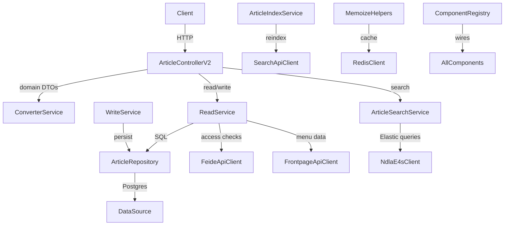

# Article API

## Overview
- Public and internal REST API for NDLA articles, exposed via Tapir endpoints in `controller/ArticleControllerV2.scala`, `controller/InternController.scala`, and the health/swagger controllers registered in `ComponentRegistry`.
- Handles full article life cycle: rich querying, tag discovery, fetching by id or slug (with revision fallback), RSS export, and write operations guarded by validation rules.
- Boots from `Main.scala`/`MainClass.scala`, which load environment configuration, trigger database migrations, and issue warm-up requests before the service is marked healthy.

## Architecture

## Key Components
- `src/main/scala/no/ndla/articleapi/ComponentRegistry.scala`: central DI/wiring that provides database connections, Redis cache, ElasticSearch client, downstream API clients (Taxonomy, Search, Frontpage, Image, MyNDLA, Feide), and registers Tapir controllers.
- `controller/ArticleControllerV2.scala`: defines the public endpoints (search, tag search, fetch by id/slug, RSS, deprecated id mappings) with rich pagination, sorting, and scroll semantics.
- `controller/InternController.scala` and `controller/ControllerErrorHandling.scala`: expose operational endpoints (rebuild indexes, health) and map domain exceptions to HTTP responses.
- `service/ReadService.scala` & `service/WriteService.scala`: encapsulate article CRUD, access control, fallback language resolution, content conversion, and downstream side effects.
- `service/search/*`: translate NDLA search models into Elastic4s requests, support scroll contexts, and keep the article index in sync through `ArticleIndexService`.
- `repository/ArticleRepository.scala`: database layer built on ScalikeJDBC, including helpers for tags, revisions, and trait migrations.
- `integration/*`: typed clients for Search API, Frontpage API, Image API, Taxonomy API, and MyNDLA, plus Redis and NDLA HTTP helpers.
- `validation/ContentValidator.scala`: HTML/tag validation before writes, delegating to shared rules in the `validation` module.

## Data Stores & External Dependencies
- **PostgreSQL**: main datastore, migrations orchestrated via `ComponentRegistry.migrator` and Flyway scripts in `db/migrationwithdependencies`.
- **ElasticSearch**: read-side search via `NdlaE4sClient`, scroll/pagination support, and indexing of article documents.
- **Redis**: caching layer for expensive content derivations exposed through `caching/Memoize.scala`.
- **Upstream Services**: Feide for access control, MyNDLA for user data, Taxonomy for classification, Frontpage and Image APIs for cross-resource embedding.

## Operational Notes
- Warmup sequences (`MainClass.warmup`) hit representative endpoints to trigger caches and mark the Tapir health controller as ready.
- Environment configuration is derived from `ArticleApiProperties` props, populated via `no.ndla.common.Environment`.
- DB migrations include semantic transformations (language normalization, resource type tagging) that must be reflected in downstream indexes.

## Testing & Tooling
- Unit and integration tests live under `src/test/scala`, executed via Mill target `./mill article-api.test`. The module depends on shared test utilities from `tapirtesting` and `scalatestsuite`.
- Trigger `./mill article-api.generateTypescript` to refresh OpenAPI schemas and the generated TypeScript bindings consumed by front-end clients.
