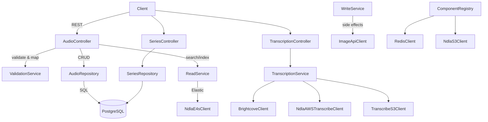

# Audio API

## Overview
- Tapir-based service for managing NDLA audio assets and series, covering metadata CRUD, file uploads, tagging, random access, and transcription workflows.
- Entrypoint `Main.scala`/`MainClass.scala` loads configuration, applies Flyway migrations, and performs warm-up requests before surfacing health checks.

## Architecture

## Key Components
- `src/main/scala/no/ndla/audioapi/ComponentRegistry.scala`: wires database, Redis cache, Elastic4s search client, NDLA downstream clients, AWS S3/Transcribe clients, repositories, services, and controllers.
- `controller/AudioController.scala` & `controller/SeriesController.scala`: define public CRUD/search endpoints, bulk tag queries, and media upload flows for audio files and series.
- `controller/TranscriptionController.scala`: exposes operations for extracting audio from Brightcove videos, kicking off AWS Transcribe jobs, and polling their status.
- `service/ReadService.scala`, `service/WriteService.scala`, `service/ConverterService.scala`, and `service/ValidationService.scala`: encapsulate business logic for metadata transformation, persistence, validation, and Elastic index synchronization.
- `service/TranscriptionService.scala`: orchestrates audio extraction (via FFmpeg/JAVE), S3 storage, and AWS Transcribe job management, including deduplication of in-flight jobs.
- `repository/AudioRepository.scala` & `repository/SeriesRepository.scala`: database layer for metadata, tags, revisions, and series ordering.
- `integration/NDLAS3Client.scala` & `integration/TranscribeS3Client.scala`: typed wrappers around NDLA-managed S3 buckets used for storing originals, derivatives, and transcription artefacts.

## Data Stores & External Dependencies
- **PostgreSQL** via ScalikeJDBC for persistent metadata.
- **ElasticSearch** for search and listing support, powered by `service/search` helpers.
- **Redis** memoization for expensive lookups (`caching/Memoize.scala` helpers).
- **AWS S3** buckets for raw uploads and transcription artefacts, mediated through `NdlaS3Client` and `TranscribeS3Client`.
- **AWS Transcribe** for speech-to-text, via `NdlaAWSTranscribeClient`.
- **Brightcove** integration to fetch video sources prior to transcription.

## Operational Notes
- Transcription jobs are idempotent—`TranscriptionService` checks existing S3 artefacts and job states before launching new AWS jobs.
- File uploads stream to S3; metadata writes and deletions propagate into Elastic indexes to keep search results consistent.
- Warm-up requests hit both search and CRUD endpoints to populate caches before the instance comes online.

## Testing & Tooling
- Execute module tests with `./mill audio-api.test`. Test sources use common fixtures from `tapirtesting` and `scalatestsuite`.
- Generate OpenAPI + TypeScript definitions with `./mill audio-api.generateTypescript` to keep front-end contracts in sync.

