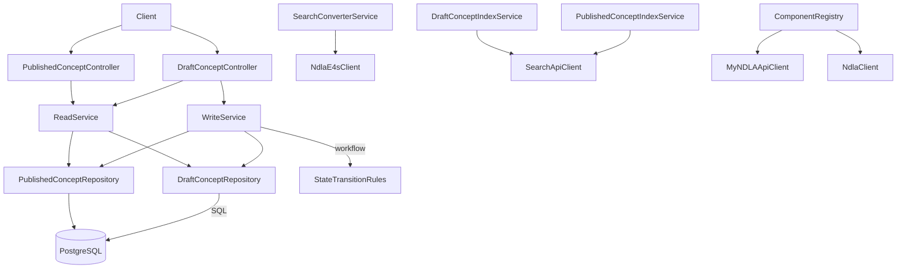

# Concept API

## Overview
- REST API for NDLA concepts (glossaries) with separate surfaces for draft and published content, built with Tapir and configured via `Main.scala`/`MainClass.scala`.
- Provides rich search, indexing, validation, and workflow transitions (draft ⇄ ready ⇄ published), backed by PostgreSQL and ElasticSearch.

## Architecture

## Key Components
- `src/main/scala/no/ndla/conceptapi/ComponentRegistry.scala`: assembles Tapir controllers, repositories, services, Elastic4s client, and downstream clients (MyNDLA, Search API) while wiring Flyway migrations for subject-tag enrichment.
- `controller/DraftConceptController.scala` / `controller/PublishedConceptController.scala`: expose CRUD, search, publishing, and admin endpoints for draft and published concepts respectively, including authorization scopes (`Permission.thatStartsWith("concept")`).
- `service/WriteService.scala`: applies `StateTransitionRules`, validation, and search index updates during mutations.
- `service/ReadService.scala` and `service/ConverterService.scala`: compose domain models, enforce visibility rules, and translate to API DTOs.
- `service/search/*`: maintain Elastic indexes for draft and published concepts; `SearchConverterService` bridges domain models to search documents.
- `validation/*`: HTML/content validation and glossary-specific business rules (`GlossDataValidator`, `ContentValidator`).
- `repository/*`: ScalikeJDBC repositories for draft and published tables, with helpers for trait/tag propagation.

## Data Stores & External Dependencies
- **PostgreSQL**: authoritative storage, migrations managed by `DBMigrator` within the registry.
- **ElasticSearch**: search and autocomplete support for both draft and published concepts.
- **Search API**: downstream service used for bulk re-indexing.
- **MyNDLA**: user details for auditing and permission checks on draft endpoints.
- **NDLA Core Client**: HTTP client for other internal services.

## Operational Notes
- Publishing flows push content from draft to published tables while keeping both Elastic indexes synchronized.
- Validation relies on shared HTML/tag validators from the `validation` module; keep those in sync when adjusting allowed markup.
- Swagger/OpenAPI metadata (`SwaggerDocControllerConfig`) is generated automatically and should be kept up-to-date by running `./mill concept-api.generateTypescript`.

## Testing
- `./mill concept-api.test` runs unit tests, leveraging shared fixtures from `tapirtesting` and `scalatestsuite`.

