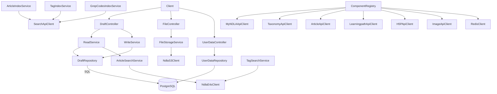

# Draft API

## Overview
- Backend service that manages article drafts, attachments, and user-specific workspace data for NDLA editors.
- Supports full CRUD, workflow transitions, attachment uploads, tagging, saved searches, and synchronization with downstream systems.
- Boots via `Main.scala`/`MainClass.scala`, performing warm-up requests and applying Flyway migrations before exposing health endpoints.

## Architecture

## Key Components
- `ComponentRegistry.scala`: assembles dependencies—PostgreSQL, ElasticSearch, Redis, NDLA internal clients (Article, Image, Taxonomy, Learningpath, H5P, Search), attachment S3 storage, and Tapir controllers.
- `controller/DraftController.scala`: exposes endpoints for draft CRUD, workflow transitions, indexing, and tag management. Integrates with `StateTransitionRules` for publishability checks.
- `controller/FileController.scala`: handles multipart uploads/downloads to S3 and manages attachment metadata.
- `controller/UserDataController.scala`: persists per-user preferences and saved resources.
- `service/WriteService.scala` & `service/ReadService.scala`: coordinate repository access, validation, search index synchronization, and downstream re-index triggers.
- `service/search/*`: maintain Elastic indexes for drafts, tags, and GREP codes; provide search/scroll functionality.
- `service/FileStorageService.scala`: encapsulates S3 path conventions, upload guards, and cleanup routines.
- `integration/*`: typed HTTP clients for Article API, Taxonomy API, Search API, Learningpath API, H5P API, Image API, and reindex helpers.
- `validation/ContentValidator.scala`: enforces HTML/rule compliance using the shared `validation` module.

## Data Stores & External Dependencies
- **PostgreSQL**: master store for draft content and user data (`repository/*`).
- **AWS S3**: attachment storage managed by `NdlaS3Client`.
- **ElasticSearch**: search for drafts, tags, and GREP codes (via `service/search`).
- **Redis**: memoization/caching of expensive reads.
- **Internal Services**: Article, Taxonomy, Learningpath, H5P, Image, Search APIs, and MyNDLA.

## Operational Notes
- Warm-up hits multiple search endpoints and health checks to populate caches and verify connectivity.
- `StateTransitionRules` centralize the business logic for allowable draft status transitions—update these when adding new workflow states.
- Migrations under `db/migrationwithdependencies` include data backfills (language normalization, saved search migration); ensure they run before deploying schema-dependent changes.

## Testing & Tooling
- Run `./mill draft-api.test` to execute the module’s test suite (leveraging `tapirtesting` and `scalatestsuite`).
- Refresh OpenAPI + TypeScript contracts via `./mill draft-api.generateTypescript`.

