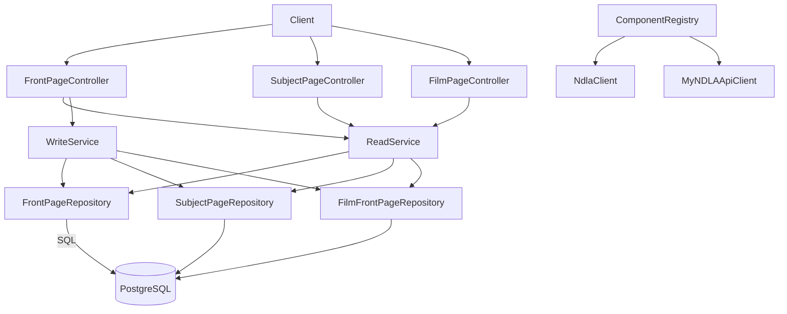

# Frontpage API

## Overview
- Service responsible for NDLA subject, frontpage, and film landing pages, exposing CRUD and read endpoints for curated content blocks.
- Starts via `Main.scala`/`MainClass.scala`, running migrations and warm-up calls before advertising health.

## Architecture

## Key Components
- `ComponentRegistry.scala`: wires Postgres access, domain repositories, MyNDLA client, default converters, and Tapir controllers (front page, subject page, film page, intern, health).
- `controller/FrontPageController.scala`, `SubjectPageController.scala`, `FilmPageController.scala`: REST endpoints for managing curated page layouts, including publication toggles and localized content.
- `service/ReadService.scala` / `service/WriteService.scala`: encapsulate conversion to API DTOs, MyNDLA authorization guards, and persistence logic.
- `service/ConverterService.scala`: shared mapping logic between domain rows (`model/domain`) and API shapes.
- `repository/*`: ScalikeJDBC repositories for subject/frontpage/film content, including block ordering and layout serialization.

## Data Stores & Dependencies
- **PostgreSQL** holds curated page definitions; migrations are currently empty but orchestrated by `DBMigrator`.
- **MyNDLA** integration for retrieving user context when editing restricted content.
- **NdlaClient**: shared HTTP client for internal callbacks.

## Operational Notes
- Keep schemas in `model/domain` synchronized with repository queries to avoid JSON serialization drift.
- When introducing new page types, extend repositories and update `ComponentRegistry` to register controllers and converters.

## Testing & Tooling
- Execute tests with `./mill frontpage-api.test`.
- Regenerate OpenAPI + TypeScript contracts via `./mill frontpage-api.generateTypescript`.

