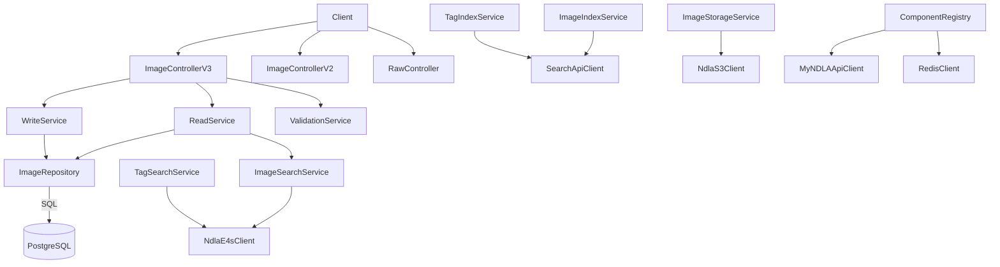

# Image API

## Overview
- Provides upload, management, and search capabilities for NDLA images, including raw retrieval, metadata CRUD, tag handling, and random image selection.
- Boot sequence (`Main.scala`/`MainClass.scala`) loads configuration, migrates the database, and issues warm-up requests before the service is marked healthy.

## Architecture

## Key Components
- `ComponentRegistry.scala`: sets up database connectivity, S3 storage (`NdlaS3Client`), Elastic4s search client, Redis cache, MyNDLA integration, repositories, services, and controllers (V2/V3 APIs, raw binary, intern, health).
- `controller/ImageControllerV3.scala` (and V2): expose REST endpoints for listing, searching, fetching, uploading, updating, and deleting images, plus tag discovery and random selection.
- `controller/RawController.scala`: serves original binaries directly from S3 with caching headers.
- `service/ReadService.scala` / `service/WriteService.scala`: coordinate repository access, search synchronization, validation, and asset storage via `ImageStorageService`.
- `service/ImageConverter.scala` and `service/ConverterService.scala`: transform between domain rows and API DTOs, normalizing locale-specific metadata.
- `service/ValidationService.scala`: enforces upload invariants (file type, tags, licenses) prior to persistence.
- `service/search/*`: search & indexing helpers for images and tags.
- `repository/ImageRepository.scala`: database abstraction for metadata storage, tag lookups, and agreement management.
- `db/migrationwithdependencies`: Flyway migrations that backfill agreements and translate author data.

## Data Stores & External Dependencies
- **PostgreSQL**: authoritative metadata store.
- **AWS S3**: binary asset storage for originals and derivatives.
- **ElasticSearch**: search backend for metadata-driven queries.
- **Redis**: caching layer for expensive transforms (via `caching/Memoize.scala`).
- **MyNDLA**: authorization context for restricted assets.

## Operational Notes
- Random selection is provided by `service/Random.scala`, using cached pre-computed pools when available.
- Binary upload/update pipelines ensure S3 consistency before database writes to avoid dangling metadata.
- Keep validation rules aligned with shared HTML/tag definitions in the `validation` module when allowing content with embedded references.

## Testing & Tooling
- Run `./mill image-api.test` for the module’s tests.
- Regenerate OpenAPI and TypeScript bindings with `./mill image-api.generateTypescript`.

