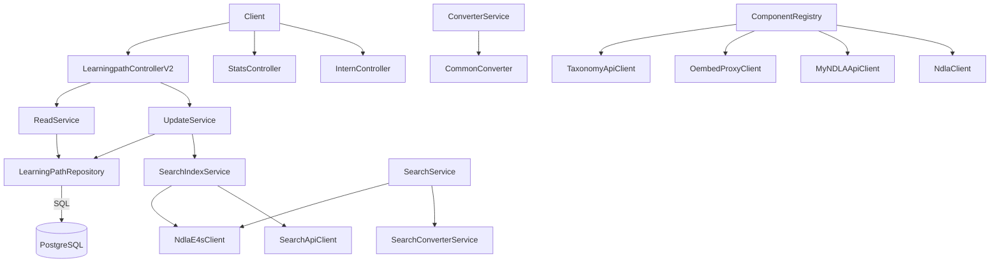

# Learningpath API

## Overview
- Service for creating, updating, and serving NDLA learning paths (collections of learning steps), with validation, statistics, and search integration.
- Bootstrapped by `Main.scala`/`MainClass.scala`: loads environment props, migrates the database, warms up key endpoints, and then signals readiness through Tapir health checks.

## Architecture

## Key Components
- `ComponentRegistry.scala`: wires PostgreSQL access, Elastic4s client, Taxonomy/Search/OEmbed/MyNDLA integrations, validation services, and Tapir controllers.
- `controller/LearningpathControllerV2.scala`: REST endpoints for CRUD, publication, ordering of steps, and localized content management.
- `controller/StatsController.scala`: exposes analytics endpoints (usage counts, published status distribution).
- `service/UpdateService.scala` & `service/ReadService.scala`: coordinate repository reads/writes, enforce business rules, and trigger search indexing.
- `service/search/*`: manage Elastic documents for learning paths and provide search/scroll handling.
- `validation/*`: granular validators for title, text length, URL formats, status transitions, duration, and language support.
- `repository/LearningPathRepository.scala`: ScalikeJDBC repository for learning paths, steps, and associations.
- `validation/LearningPathValidator.scala` etc.: aggregate validators reused by services prior to persistence.
- `integration/*`: HTTP clients for Search API, Taxonomy, OEmbed proxy (for embedded external content), and MyNDLA.

## Data Stores & External Dependencies
- **PostgreSQL** for learning path definitions and step metadata; migrations under `db/migrationwithdependencies` manage schema/data evolution.
- **ElasticSearch** for search and filtering, handled by `SearchIndexService` and `SearchService`.
- **Search API** for bulk re-index operations; `SearchApiClient` triggers rebuilds.
- **Taxonomy API** to resolve subject metadata; **OEmbed Proxy** for rich embeds; **MyNDLA** for user context.

## Operational Notes
- Validation occurs before any database mutation—ensure new fields have corresponding validators to avoid inconsistent data.
- Search index synchronization happens as part of write flows; monitor Elastic cluster health before bulk updates.
- Warm-up requests (in `MainClass`) cover representative search/read endpoints to ensure caches and downstream dependencies load successfully.

## Testing & Tooling
- Run `./mill learningpath-api.test` for automated tests.
- Generate/update OpenAPI + TypeScript definitions with `./mill learningpath-api.generateTypescript`.

