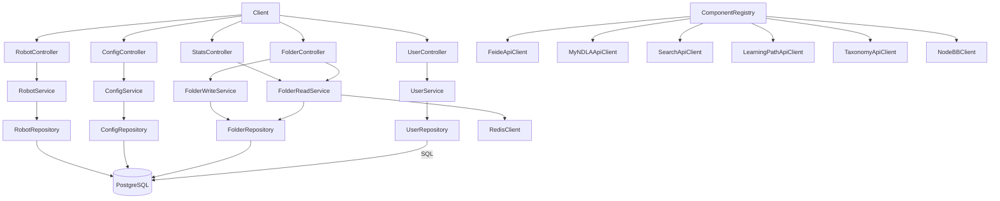

# MyNDLA API

## Overview
- Backend service for NDLA’s personalized MyNDLA experience, handling user folders, robots, configuration, and statistics.
- Entry `Main.scala`/`MainClass.scala` loads configuration, runs migrations, instantiates dependency graph, and performs warm-up checks.

## Architecture

## Key Components
- `ComponentRegistry.scala`: wires database utilities, Redis cache, Feide/MyNDLA auth clients, NodeBB forum client, Search/Taxonomy/Learningpath integrations, repositories, services, and controllers.
- `controller/*`: Tapir controllers providing CRUD endpoints for users, folders (with nested resources), robots (automation rules), configuration flags, and stats queries.
- `service/UserService.scala`, `service/FolderReadService.scala`, `service/FolderWriteService.scala`, `service/ConfigService.scala`, `service/RobotService.scala`: encapsulate domain logic, apply authorization via Feide/MyNDLA, and coordinate side effects such as search indexing or forum updates.
- `repository/*`: ScalikeJDBC repositories for MyNDLA-specific tables, including hierarchical folder structures and robot execution plans.
- `integration/nodebb/NodeBBClient.scala`: wraps forum operations for robot/community features.
- `MyNDLAAuthHelpers.scala`: convenience for combining MyNDLA and Feide tokens using the shared `network` module’s auth primitives.

## Data Stores & External Dependencies
- **PostgreSQL**: primary persistence layer; migrations (e.g., `V16__MigrateResourcePaths`) live under `db/migrationwithdependencies`.
- **Redis**: caches user and folder views for fast navigation.
- **Feide & MyNDLA APIs**: user identity and permissions.
- **Search API**: indexing hooks for personalized content discovery.
- **Taxonomy & Learningpath APIs**: resolve referenced resources embedded within folders/robots.
- **NodeBB**: optional community integration.

## Operational Notes
- Redis-backed memoization keeps folder listings responsive—ensure eviction policy matches usage.
- Robots can trigger external side effects; monitor NodeBB connectivity when deploying rule changes.
- `ComponentRegistry` lazily instantiates migrations before controllers; keep new migrations dependency-safe.

## Testing & Tooling
- Execute `./mill myndla-api.test` to run module tests.
- Regenerate OpenAPI/TypeScript definitions via `./mill myndla-api.generateTypescript`.

