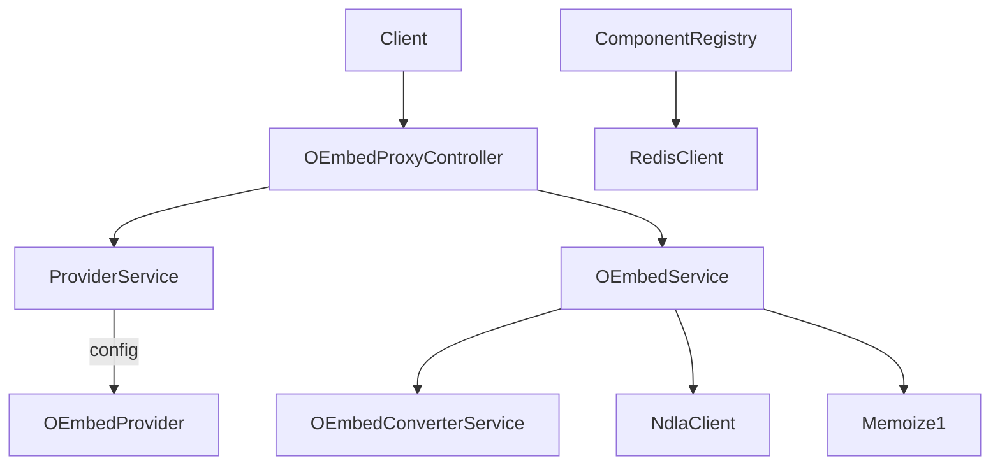

# OEmbed Proxy

## Overview
- Lightweight service that acts as a proxy and cache for third-party OEmbed providers, ensuring consistent responses and validation for external embeds used inside NDLA content.
- Starts via `Main.scala`/`MainClass.scala`, loading configuration, wiring dependencies, and registering Tapir controllers.

## Architecture

## Key Components
- `ComponentRegistry.scala`: instantiates the provider registry, OEmbed service, Redis-backed memoization helper, NDLA HTTP client, and Tapir controllers (proxy, intern, swagger, health).
- `controller/OEmbedProxyController.scala`: defines endpoints for fetching embed metadata given remote URLs, handling caching headers and validation errors.
- `service/OEmbedService.scala`: orchestrates provider lookup, upstream HTTP calls (via `NdlaClient`), caching, and DTO conversion (`OEmbedConverterService`).
- `service/ProviderService.scala`: manages `OEmbedProvider` and `OEmbedEndpoint` configurations, including host whitelists and endpoint overrides.
- `model/*`: DTOs for providers, endpoints, and responses returned to clients.
- `caching/Memoize1.scala`: small utility for memoizing expensive provider discovery calls.

## Data & Dependencies
- Relies on Redis (through `network.RedisClient`) for caching OEmbed responses.
- Uses NDLA shared HTTP client to call remote providers with consistent timeout/retry logic.
- Swagger/OpenAPI metadata is generated from `SwaggerDocControllerConfig.scala`.

## Testing & Tooling
- Run `./mill oembed-proxy.test` for unit tests (leveraging `tapirtesting`).
- Update TypeScript contracts with `./mill oembed-proxy.generateTypescript`.

