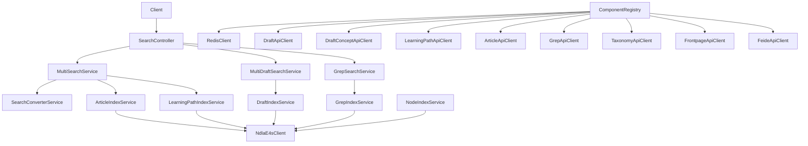

# Search API

## Overview
- Aggregated search service that indexes and queries NDLA resources (articles, drafts, learning paths, concepts, GREP codes, taxonomy nodes) across multiple upstream systems.
- Startup (`Main.scala`/`MainClass.scala`) loads configuration, primes caches, and registers Tapir controllers once downstream dependencies respond.

## Architecture

## Key Components
- `ComponentRegistry.scala`: wires Elastic4s client, Redis cache, downstream API clients (Article, Draft, Concept, Learningpath, GREP, Taxonomy, Frontpage, MyNDLA, Feide), search/index services, and Tapir controllers (search, intern, health).
- `controller/SearchController.scala`: defines endpoints for global search, draft-only search, GREP lookup, autocomplete, scroll pagination, and index management actions.
- `service/search/*`: specialized services for each resource type (articles, drafts, learning paths, GREP codes, taxonomy nodes), plus `MultiSearchService` that aggregates results and handles permission filtering via Feide/MyNDLA context.
- `service/ConverterService.scala`: converts domain search hits into API DTOs while applying trait utilities (`TraitUtil`) for classification.
- `integration/*`: HTTP clients for upstream services, plus `ZipUtil` helpers for archive downloads.

## Data Stores & External Dependencies
- **ElasticSearch**: central search index storing denormalized documents for all resource types.
- **Redis**: caching layer for expensive multi-search responses and scroll contexts.
- **Upstream APIs**: Article, Draft, Draft Concept, Learningpath, Grep, Taxonomy, Frontpage services provide source data for indexing.
- **Feide/MyNDLA**: used for permission filtering and personalized results.

## Operational Notes
- Index services support both live updates and full rebuilds; ensure Elastic cluster capacity before kicking off bulk operations.
- Scroll endpoints expose long-lived search contexts; clients must honor the `search-context` header returned by controllers.
- Taxonomy and GREP integrations cache lookups—refresh caches when upstream data changes materially.

## Testing & Tooling
- Execute `./mill search-api.test` to run the module’s tests, which rely on `tapirtesting` and shared fixtures.
- Generate OpenAPI + TypeScript definitions with `./mill search-api.generateTypescript`.

